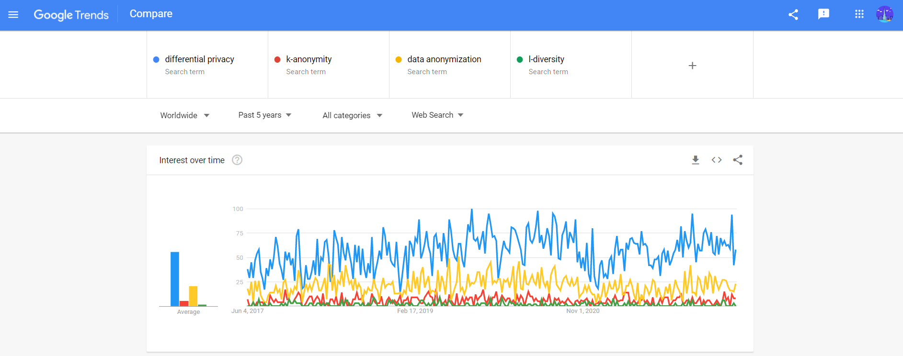

\pagebreak

# General Introduction

## The urgency of this study

The main reason of choosing this topic: **Preserving privacy for Publishing Time-series data with Differential Privacy** is to apply the knowledge in Differential Privacy with multiple mechanisms into the practical challenges in protecting privacy for Publishing Time-series data to outsourcing analytics services. The ultimate goal is protecting privacy of individual while keeping the Time-series data features *(auto-correlation, trends and seasonality, data distribution, and forecast-able)*. While some of the current solutions likes *Anonymization, k-Anonymity, l-Diversity* aren't enough for fighting against the re-identification process from attacker (mostly, with *linkage attack*), also it's not compatible with the concept of Big Data because of their complexity in algorithms; thereby, it is a huge demand on researching a new mechanism, and Differential Privacy is becoming one of the big research fields since 2006 when it first came.

In the next 3 sections, it will be clearer for explaining the urgency of this study via 3 aspects: the social motivation on privacy research, the differential privacy as the emerging mechanisms for protecting privacy, and the trending in publishing time-series data for analysis.

## Social motivation on Privacy research

We are living in the world of Big Data, and we are providing our personal data to hundreds of applications every-day, which is most of the time, we don't really aware what we are sharing to the application vendors. From the definition of GDPR in Art. 4 Definitions, "'personal data' means any information relating to an identified or identifiable natural person ('data subject'); an identifiable natural person is one who can be identified, directly or indirectly, in particular by reference to an identifier such as a name, an identification number, location data, an online identifier or to one or more factors specific to the physical, physiological, genetic, mental, economic, cultural or social identity of that natural person;". And naturally, while getting into the digital world with smart devices/ smart applications/... we provide our data for the vendors to do account registration, account management, improve user experience program, and more.

For instances, if someone uses iOS/Android devices, then they provides their information to Apple/Google for account management; the company also tracks the behaviors on the device to improve the the user experience; improve the relevant advertisement visibility; and if they uses smart-watch devices, the vendor will also know about their daily heart-beat & daily-steps, which can easily inference to the activity of a whole day of the user. Moreover, every-time they used Facebook/Twitter/any-social-app, they provide photos/face identity/hobbies/interests/politics perspectives/... via direct posting or just a reaction button; then every-time they go to any websites in the Internet, surely they will be tracked with Google Analytics/Adobe Tag Manager/... or self-implemented tracker via cookies.

After the scandal of Cambridge Analytics and Facebook in 2018 released, people are more concerning on their privacy on digital platforms (in a survey of Raymond James Investment firm, 84% of Facebook users concerned about how the App used their data). No-one wants their data to be using without their consent, also, no-one wants to be known so-well and be manipulated / be driven - especially in the politics perspective.

To protect the privacy right of people, one-of the latest and strict regulation is released in 2016 under the name General Data Protection Regulation (GDPR) in European - effective for all European companies since May 2018. This regulation, in general, protect the right-to-control (and right-to-delete) personal data of EU-citizen on digital platforms. However, to comply with GDPR and other privacy regulations, the system (e.g: the health-app tracking heartbeat, the recommendation system,...) needs to be designed differently. Take an example of recommendation system, the algorithms will "remember who-is-who", and can be used to re-identify the user; which doesn't protect the privacy at all.

Additionally, the needs of sharing data between multiple parties for analytics purposes are increasing with the trends of Open Data, Outsourcing data analytics, and these needs also raise more concern about personal privacy. For more detail, the user accept to share their personal data for the application vendors, and they won't aware about the third-parties analytics vendor, and to ask for further consent from user to conduct analytics may costly and inefficient. Another use-cases in this can be noted is the case of public-data sharing for public-analytics in traffic monitoring, hospital-sickness, trajectories and point-of-interests; although the data is anonymize with some techniques: remove PII (Personal Identifiable Information); k-anonymity; l-diversity;... sometimes it can be re-identify via information from other-public-database (in case of Netflix reviews competition in 2007 and case of Massachusetts Group Insurance Commission in 1997).

Therefore, it's obviously a big need for researching in protecting privacy, and Differential Privacy is an emerging research field for solving the privacy issue in Big Data and Machine Learning era.

## Differential Privacy as a new challenger in this journey

Bla bla

## Time-series data as the subject of concern

Bla bla