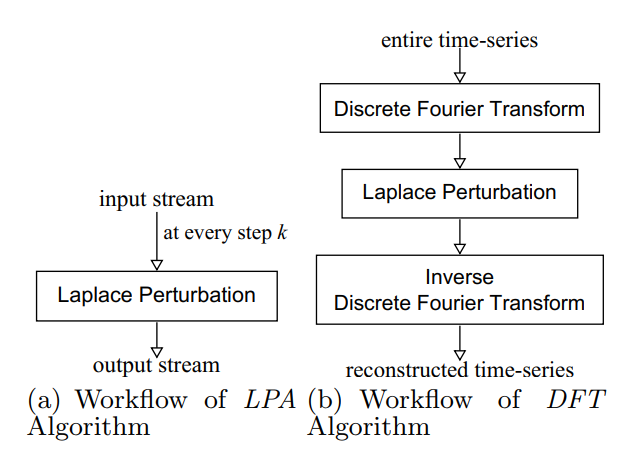

\pagebreak

# Related Works Review

## Traditional techniques to protect privacy

### Anonymization

From the definition of **Pseudonymization in ISO 25237:2017 Health informatics** [@iso_2022], it has been defined as a "process by which personal data is altered in such a way that a data subject can no longer be identified directly or indirectly, either by the data controller alone or in collaboration with any other party."

To conduct this process, we will try to remove the *Personally Identifiable Information (PII - e.g.: email, full-name, ID card number, credit card number, phone-number, full-address...)* from the dataset, then we can publish this data to the public and assume no-one can find who-is-who. This technique has been used for a long time, but it is not a good technique for now. To prove that statement, from the research of [@Sweeney2000], she concluded that 87% of American people can be identified with just Gender - Birthday - ZIP code. This is called linkage attack (or background knowledge attack) - when the attacker knew "something" about their target (This will be discussed in some next section).

### k-Anonymity and l-Diversity

The k-Anonymity was first introduced by [@Sweeney1998] in a paper published in 1998 as an attempt to solve the problem: *"Given person-specific field-structured data, produce a release of the data with scientific guarantees that the individuals who are the subjects of the data cannot be re-identified while the data remain practically useful."*  

The formal definition of k-Anonymity is: at least k individuals in the dataset share a set of attributes that might become identifying for each individual, such that each member of that k-group shares the same quasi-identifiers (a selected subset of all the dataset columns) with all of other members of the group. It means, each individual in each group will blend into their group, so it makes harder to identify individual in that k-group.

The drawback of k-Anonymity is the extensive computational with complexity level is $O(n^2)$ (which is not fit for Big Data era), also it's a NP-hard problem. Besides, k-Anonymity can be attacked when the data have outliers/abnormal data point or data have only identical records (that is called Homogeneity attack).

To enhance the privacy level of k-Anonymity in the case of Homogeneity attack, there is a suggestion that called l-Diversity - proposed in 2006 by [@Machanavajjhala] from Cornell University. The main idea here is: l-Diversity states that each bucket must have at least **l-distinct-sensitive-values**. However, the usage of l-Diversity is limited because of its worser data utilization ("applying 3-diversity dataset was worse than using 100-anonymity") that was mentioned in the study of [@Brickell2008TheCO] from University of Texas at Austin in 2008 .

### PCA - Principal Component Analysis

PCA - Principal Component Analysis was invented by Karl Pearson in 1901 with the original purpose is to conduct the dimensional reduction. A formal definition of PCA, is the process of computing the principal components and using them to perform a change of basis on the data, sometimes using only the first few principal components and ignoring the rest. This technique helps capture the importance features in the dataset by emphasizing the variation and capture strong patterns in a dataset.

Utilizing PCA as a technique to protect privacy is a reasonable idea in the case of large-multi-columns dataset. It can help hiding the sensitive in the most of columns by converting it into smaller dimensions, and it can't be reversed because we don't know the each column of the result is constructed by which columns from the input. However, the data utility here needs clarity: the result after doing PCA is good for Machine Learning modelling because it helps to capture important information (in modelling view) and can produce a good quality of model; however, the PCA result can't be understood when doing EDA or analytics, and can't take any insights from here.

### Statistics aggregation

Most of the time, data will be sharing in the aggregation format (e.g.: average height of class A is 10.5, average salary of Data Science job in company X is $10000, average cars at 5PM on street A in July is 100,...) and the publisher thinks it can't be reverse to find individuals. This technique usually implements in the Data Query system, when the analyst want to get some aggregated data and the system calculate the aggregation on-demand.

However, this technique will fail to protect privacy when the aggregation group with just a few to very few individual, cause it may return the exactly the sensitive value and no-privacy-at-all. And in the world of Big Data and Real-time data querying, this technique will be attacked by the Differencing attacks - which will be mentioned in the next section.

## Techniques to re-identify anyone in database

### Linking attacks

The Linking attacks (or sometimes it's called Linkage attacks) involves the combination of auxiliary data with de-identified data to re-identified individuals. This is a common attack, and there are some notable efforts using this:

- In 1997, the effort of identifying medical records of William Weld - Massachusetts governor of Latanya Sweeney by combining de-identified public data of Massachusetts Medical Records with the Massachusetts Voter lists. [@sweeney_2015]
- In 2006, the effort of identifying individual movies reviews from Netflix public dataset of [@Arvind2006] (two PhD students of University of Texas at Austin) by combining with public IMDB reviews and comments. [@]
- In 2008, the effort of identifying search results of individual from AOL public dataset of Michael Barbaro and Tom Zeller (two reporters of The New York Times) by combining phone-book directory and the search queries itself. [@orlowski_2006]

### Differencing attacks

The differencing attacks happens when the attacker try to isolate individual from the statistics aggregation mask. An example for this is using 2 queries, one is finding the sum age of total employee, and one is finding a sum age of total employee except the target one (by using filtering on some of other data features), then calculate the difference and the exact result show up.

## Differential Privacy research

From the summary about Differential Privacy of Harvard Differential Privacy research group [@Harvard_DP_RG], the *"Differential privacy is a rigorous mathematical definition of privacy. In the simplest setting, consider an algorithm that analyzes a dataset and computes statistics about it (such as the data's mean, variance, median, mode, etc.). Such an algorithm is said to be differentially private if by looking at the output, one cannot tell whether any individual's data was included in the original dataset or not. In other words, the guarantee of a differentially private algorithm is that its behavior hardly changes when a single individual joins or leaves the dataset -- anything the algorithm might output on a database containing some individual's information is almost as likely to have come from a database without that individual's information. Most notably, this guarantee holds for any individual and any dataset. Therefore, regardless of how eccentric any single individual's details are, and regardless of the details of anyone else in the database, the guarantee of differential privacy still holds. This gives a formal guarantee that individual-level information about participants in the database is not leaked."*

To implement Differential Privacy in the dataset, there are some techniques will explain here, but the main idea is all about adding noise into the data to help it be different.

### Differential Privacy with adding noise mechanisms (Laplace and Gaussian random noise)

**Laplace mechanism** is a mechanism that adding noise from Laplace distribution randomly - with the config of sensitivity and $\epsilon$-differential privacy level.

The general formula of this technique: $F(x) = f(x) + Lap(s/\epsilon)$

The key-point of this technique is to quantify the $\epsilon$-differential privacy level. The larger $\epsilon$, the less privacy, and smaller $\epsilon$ (recommendation is less than 1), the better privacy, but less data utility.

*Explanation: The $M(D)$ denoted as the original distribution of the dataset; the $M(D')$ denoted as the distribution of dataset applying Laplace mechanism; and the gap of data distribution between $M(D)$ and $M(D')$ denoted as $e^\epsilon$*

Similar to Laplace mechanism, the **Gaussian mechanism** also a noise adding solution to protect privacy - but it create random noise based on Gaussian distribution. A highlight point for this technique, it doesn't work with $\epsilon > 1$.

For more detail comparing between Laplace and Gaussian, it will be researched in the full thesis.

### Differential Privacy on Time-series data with Discrete Fourier Transform, and Kalman Filtering

From the recent works of [@Rastogi2010] in 2010, they recognized that the time-series data has the characteristics of correlated between data-points, the next-point has been influenced by some previous-points; therefore, just using noise adding mechanisms likes Laplace or Gaussian is not enough to preserve time-series features. To workaround this issue, they proposed to use Discrete Fourier Transform (a technique to convert a time-series into frequency domain, to find a spectrum) and adding noise on top of the result, then using Inverse Discrete Fourier Transform to convert it back to the output time-series.

After several years, another approach was proposed by [@Fan2012AdaptivelyST] to improve the data utility of time-series after applying Differential Privacy technique. The main idea is building a controller to manage the perturbation process using Kalman filtering to predict/correct the data-point after adding noise with Laplace mechanism to protect privacy. This technique is proven to be more useful for Time-series data than the DFT, and it will be implemented to compare in thesis.

## Time-series Analysis research

To verify the data utility of Time-series after running through the privacy solution, there are some techniques to check the time-series features:

1. Time-series decomposition into Trends and Seasonality
2. Time-series features analysis with Moving Average and Auto-Correlation
3. Time-series forecasting: ARIMA - Supervised Machine Learning - Deep Learning model with LSTM

The purpose of (1) and (2), it will help to verify the ability to conduct Exploratory Descriptive Analysis (EDA) and give reasonable insight from the dataset.
And the purpose of (3) is to verify the ability to ingest into Forecasting algorithms - which is a common use-case in Time-series application.

All of these will be mentioned in more detail inside the thesis.

<!-- Bla bla

### Time-series decomposition

Bla bla

### Time-series Analysis technique: Moving Average, Auto-Correlation

Bla bla

### Time-series forecasting: ARIMA - Machine Learning Supervised - Deep Learning LSTM

Bla bla -->

\pagebreak